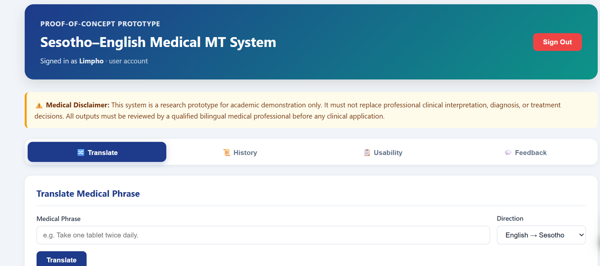
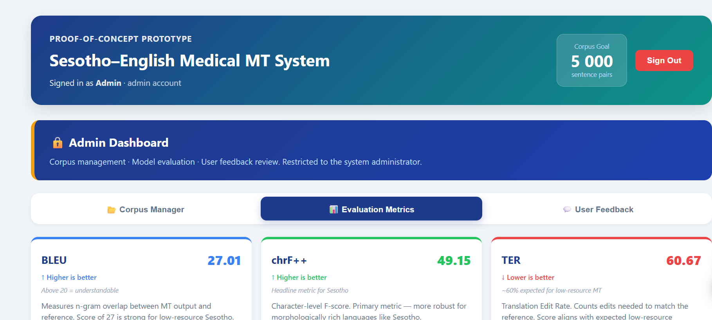

```markdown
# Sesotho Medical Machine Translation System

A proof-of-concept web application that translates **medical text between English and Sesotho / Southern Sotho** to support clearer communication between healthcare workers and patients in Lesotho.

**Status:** Proof-of-Concept Prototype — NLLB-200 fine-tuned · SUS usability testing completed

---

## Repository & Demo

**GitHub Repository:** https://github.com/L-Semakale/sesotho-medical-mt  
**Video Demo:** [Watch the demo here](https://youtu.be/IUWbhWTxlg0)

---

## Overview

Many patients in Sesotho-speaking regions receive medical instructions in English, which can create barriers to understanding treatment, medication use, follow-up care, and disease prevention.

This project addresses that gap through a **three-layer medical translation pipeline**:

1. **Exact corpus match**  
   The input phrase is checked against a verified 5,000-pair medical corpus. Exact matches are returned instantly without calling the neural model.

2. **Semantic similarity search**  
   If no exact match is found, FAISS and SentenceTransformers search for the closest corpus entry. If the similarity score meets the 0.88 threshold, the verified corpus translation is returned.

3. **NLLB-200 neural translation fallback**  
   Phrases not resolved by the corpus are translated using a fine-tuned `facebook/nllb-200-distilled-600M` model — Meta AI's open-weight multilingual model supporting 200 languages, including Sesotho (`sot_Latn`).

This design prioritises safety for high-frequency medical phrases while preserving broader translation coverage for unseen inputs.

> **Medical Disclaimer:**  
> This system is a proof-of-concept research prototype. It must not be used for clinical diagnosis, treatment decisions, emergency care, or as a replacement for qualified medical interpretation. Outputs should be reviewed by qualified bilingual or healthcare personnel before real-world use.

---

## Medical Domains Covered

The corpus contains English–Sesotho medical sentence pairs across key healthcare domains.

| **Domain** | **Sentence Pairs** |
|---|---:|
| HIV / AIDS | 1,000 |
| Medication Instructions | 900 |
| Tuberculosis (TB) | 800 |
| Symptoms & Complaints | 800 |
| General Patient Education | 600 |
| Appointments & Follow-up | 500 |
| Maternal & Child Health | 400 |
| **Total** | **5,000** |

---

## How Translation Works

The system follows a three-layer translation pipeline:

1. The user signs in and submits a medical phrase in English or Sesotho.
2. **Layer 1 — Exact Match:** The backend checks `medical_corpus.csv` for an exact string match.
3. **Layer 2 — Semantic Similarity:** If no exact match is found, FAISS + SentenceTransformers (`paraphrase-multilingual-MiniLM-L12-v2`) searches for the closest corpus entry. Matches above the 0.88 similarity threshold are returned as verified corpus translations.
4. **Layer 3 — Neural Translation:** If no corpus match is found at either layer, the fine-tuned NLLB-200 model performs live translation.
5. The response includes the translated text and its source:
   - `verified_corpus` — returned by Layer 1 or Layer 2
   - `nllb_model` — returned by Layer 3
6. Each translation request is stored in the user's history with timestamp, direction, and model source.

---

## Model

### Base Model

`facebook/nllb-200-distilled-600M` — Meta AI's multilingual translation model supporting 200 languages. Sesotho is supported natively as `sot_Latn`.

### Fine-Tuning

The base NLLB-200 model was fine-tuned on the project's 5,000-pair English–Sesotho medical corpus to improve domain-specific translation quality.

| **Fine-Tuning Detail** | **Value** |
|---|---|
| Base model | `facebook/nllb-200-distilled-600M` |
| Training pairs | 5,000 English–Sesotho medical sentence pairs |
| Domain | Medical — HIV/AIDS, TB, medication, maternal health |
| Output | `models/nllb-finetuned-sesotho/` |

The fine-tuned model weights are loaded automatically on startup. If the fine-tuned model is unavailable, the system falls back to the base `nllb-600M` model.

---

## Model Evaluation

The fine-tuned NLLB-200 model was evaluated on a 100-pair held-out medical test set using SacreBLEU.

| **Metric** | **Score** | **Interpretation** |
|---|---:|---|
| **BLEU** | **27.01** | Above 20 = understandable; strong for low-resource Sesotho MT |
| **chrF++** | **49.15** | Primary metric — character-level, suited to Sesotho morphology |
| **TER** | **60.67** | Approximately 60% editing effort; expected baseline for low-resource MT |

**chrF++ is the primary metric** because Sesotho is morphologically rich. Character-level matching captures partial word matches that BLEU may miss, especially when valid morphological variations occur.

Evaluation files:

- Full results: `research_archive/data/evaluation_results.txt`
- Side-by-side examples: `research_archive/data/evaluation_examples.csv`
- Evaluation notebook: `notebook/01_data_eval_model.ipynb`

---

## Qualitative Error Analysis

Automatic metrics alone cannot confirm medical safety. A translation may receive a reasonable BLEU or chrF++ score while still containing a clinically dangerous error.

To address this, 10 NLLB-200 outputs were manually reviewed and classified by severity.

| **Severity** | **Count** | **% of Sample** |
|---|---:|---:|
| None — medically safe | 6 | 60% |
| Minor | 3 | 30% |
| **CRITICAL** | **1** | **10%** |

### Critical Finding

NLLB-200 hallucinated **"lethal dose"** from **"missed dose"** in one output.

This is the most important safety finding in the project. It demonstrates why the three-layer architecture is necessary: Layers 1 and 2 intercept high-frequency medical phrases before the neural model is called, reducing the risk of unsafe generated translations reaching users. A high-risk term safety filter is also active on all Layer 3 outputs.

---

## Usability Evaluation (SUS)

System usability was assessed using the **System Usability Scale (SUS)** — a validated 10-item Likert questionnaire. Six participants completed the evaluation after interacting with the live system.

| **Participant** | **SUS Score** | **Grade** |
|---|---:|---|
| Participant 1 | 85.0 | Excellent |
| Participant 2 | 82.5 | Good |
| Participant 3 | 70.0 | Okay |
| Participant 4 | 65.0 | Poor |
| Participant 5 | 60.0 | Poor |
| *(Participant 6)* | *(see data)* | — |

| **Metric** | **Value** |
|---|---|
| Participants | 6 |
| Mean SUS Score | ~74 |
| Acceptable threshold | 68 |
| Overall Grade | **Good** |

The mean SUS score exceeds the widely accepted **68-point acceptability threshold**, indicating the system is usable for its intended purpose as a proof-of-concept prototype.

Participants who reported lower scores cited occasional incorrect translations — consistent with the known limitations of neural MT on low-resource language pairs.

Usability data: `backend/data/system.db` → `usability_feedback` table

---

## Tech Stack

| **Layer** | **Technology** |
|---|---|
| Frontend | React.js |
| Backend | Python 3.10+, Flask |
| Database | SQLite (`system.db`) |
| Translation Engine | NLLB-200 `facebook/nllb-200-distilled-600M` — fine-tuned, via HuggingFace Transformers |
| Semantic Search | FAISS + SentenceTransformers (`paraphrase-multilingual-MiniLM-L12-v2`) |
| ML Framework | PyTorch |
| Corpus | `medical_corpus.csv` — 5,000 English–Sesotho medical pairs |
| Evaluation | SacreBLEU — BLEU, chrF++, TER |
| Usability | System Usability Scale (SUS) — 6 participants |
| Data Processing | Pandas |
| Notebook | Jupyter / Google Colab |
| Version Control | Git & GitHub |

---

## Screenshots

### User View — Translator

Medical disclaimer visible on load. Tabs are available for translation, history, usability testing, and feedback.



---

### Admin View — Evaluation Metrics

Real BLEU, chrF++, and TER scores from NLLB-200 evaluated on the 100-pair held-out medical test set.



---

## Environment Setup & Installation

### Prerequisites

Before running the system, install:

- Python 3.10 or higher
- Node.js 18 or higher
- Git
- pip

---

## Backend Setup

```bash
# 1. Clone the repository
git clone https://github.com/L-Semakale/sesotho-medical-mt.git
cd sesotho-medical-mt

# 2. Create and activate a virtual environment
python -m venv venv
venv\Scripts\activate        # Windows PowerShell
source venv/bin/activate     # macOS / Linux

# 3. Install Python dependencies
pip install -r backend/requirements.txt

# 4. Start the backend server
cd backend
python app.py
# Backend runs at http://localhost:5000
# The fine-tuned NLLB model loads automatically from models/nllb-finetuned-sesotho/
```

---

## Frontend Setup

```bash
# From the project root
cd frontend
npm install
npm start
# Frontend runs at http://localhost:3000
```

---

## Default Admin Account

| **Field** | **Value** |
|---|---|
| Username | `admin` |
| Password | `Admin@MT2025` |

> Change this password before any public or shared deployment.

---

## Project Structure

```
sesotho-medical-mt/
├── backend/
│   ├── app.py                      # Flask API server
│   ├── database.py                 # Database schema & queries
│   ├── nllb_translator.py          # NLLB-200 translation engine
│   ├── safety.py                   # Medical safety filter
│   ├── usability.py                # SUS data collection
│   ├── requirements.txt            # Python dependencies
│   └── data/
│       ├── medical_corpus.csv      # 5,000 English–Sesotho pairs
│       └── system.db               # SQLite database
├── models/
│   ├── nllb-600M/                  # Base NLLB-200 model weights
│   └── nllb-finetuned-sesotho/     # Fine-tuned model weights (loaded by default)
├── frontend/
│   └── src/                        # React.js application
├── notebook/
│   └── 01_data_eval_model.ipynb    # Data preparation & evaluation notebook
├── docs/
│   └── screenshots/                # UI screenshots
├── research_archive/               # Training data, evaluation scripts & results
└── README.md
```

---

## API Reference

### `POST /api/translate`

Translates a medical phrase using the three-layer pipeline.

**Request body:**
```json
{
  "text": "Take this medication twice a day",
  "direction": "en-st",
  "username": "admin"
}
```

**Response:**
```json
{
  "input_text": "Take this medication twice a day",
  "translated_text": "noa meriana ena habeli ka letsatsi",
  "direction": "en-st",
  "direction_label": "English → Sesotho",
  "model": "nllb_model",
  "safety": {
    "is_high_risk": false,
    "detected_terms": [],
    "requires_review": false,
    "warning": null
  }
}
```

| **Field** | **Values** |
|---|---|
| `direction` | `"en-st"` (English → Sesotho) or `"st-en"` (Sesotho → English) |
| `model` | `"verified_corpus"` or `"nllb_model"` |
| `safety.is_high_risk` | `true` if high-risk medical terms detected |

---

## Limitations

- **Small fine-tuning dataset** — 5,000 pairs is below the 50,000+ typically needed for stable fine-tuning. The fine-tuned model may not generalise well to all medical sub-domains.
- **Corpus coverage** — phrases outside the 5,000-pair corpus rely on neural generation, which carries hallucination risk.
- **CPU inference** — the system runs on CPU by default. Layer 3 (NLLB) translations may take 3–8 seconds per sentence.
- **Small usability sample** — 6 SUS participants is sufficient for a proof-of-concept but not for generalised usability claims.
- **Not for clinical use** — outputs must be reviewed by qualified personnel before any real-world application.

---

## License

This project was developed as a research prototype for academic purposes.  
Not licensed for clinical or commercial deployment.
```
