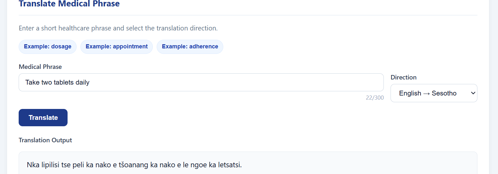
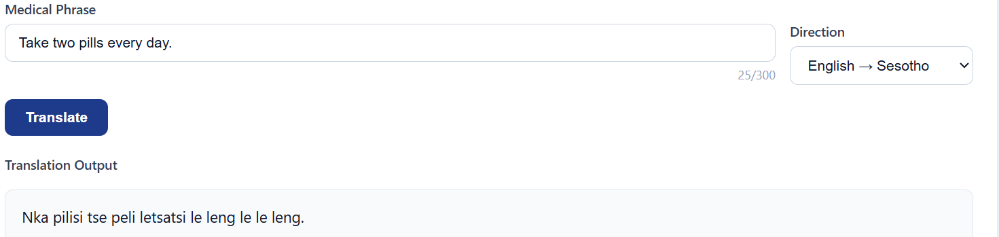
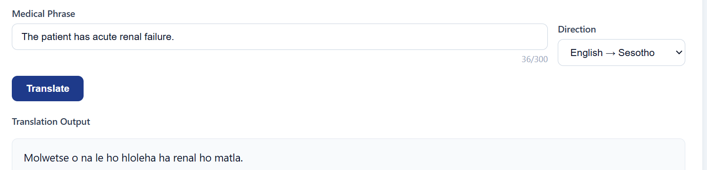
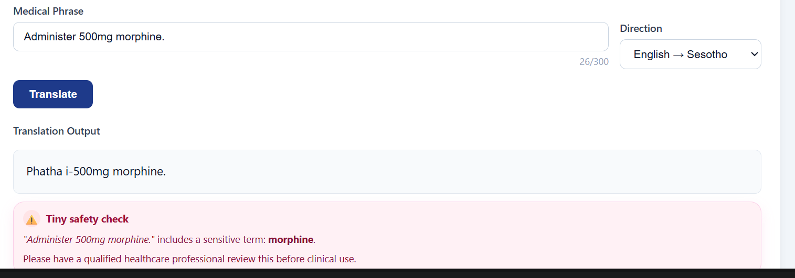
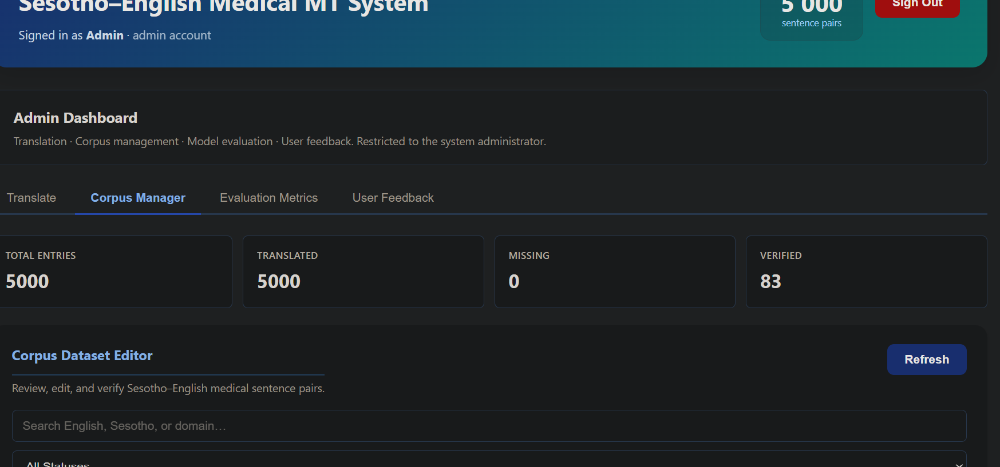
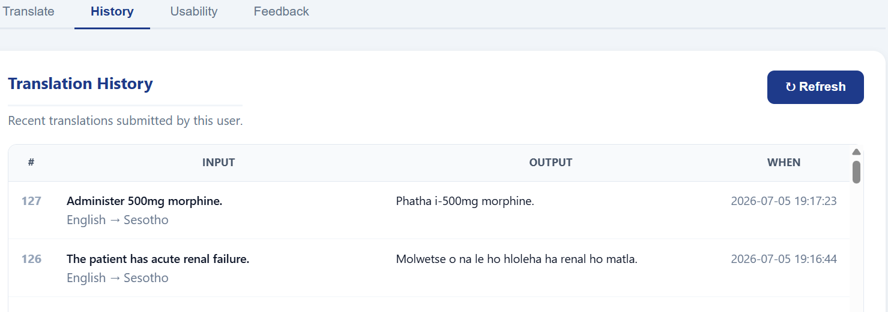
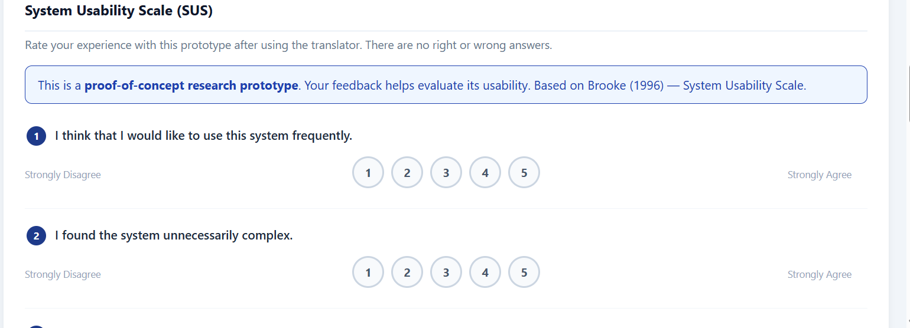
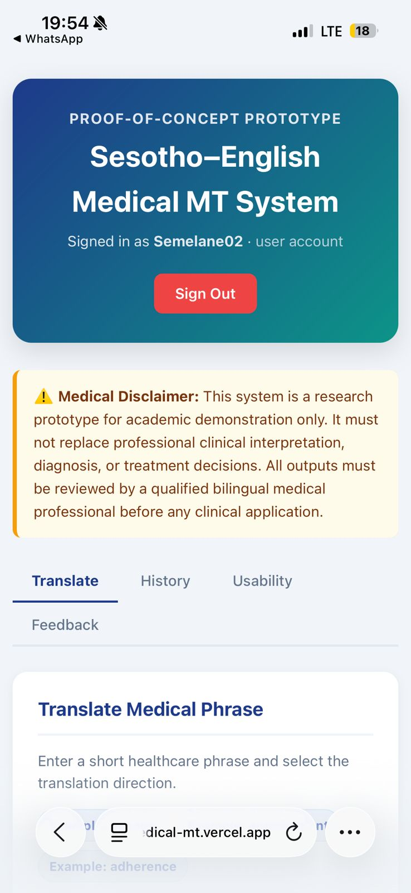

# Sesotho Medical MT

A bilingual **English–Sesotho medical translation web application** designed to bridge the language gap in Lesotho's healthcare system.

> **Medical Disclaimer:** This is a research prototype. It is not intended for clinical diagnosis, treatment decisions, or emergency care. All outputs must be reviewed by qualified healthcare personnel.

---

## Links

| Resource | URL |
|---|---|
| Live App | https://sesotho-medical-mt.vercel.app |
| Demo Video | https://youtu.be/Q8Cm0FbNWYQ |
| Fine-tuned Model | https://huggingface.co/Limpho/nllb-finetuned-sesotho |
| Backend API | https://limpho-sesotho-medical-backend.hf.space |

---

## Installation & Setup

### Prerequisites

Make sure the following are installed:

- Python 3.9+
- Node.js 18+
- Git

---

### 1. Clone the Repository

```bash
git clone https://github.com/L-Semakale/sesotho-medical-mt.git
cd sesotho-medical-mt
```

---

### 2. Backend Setup — Flask

```bash
cd backend
python -m venv venv
```

Activate the virtual environment:

```bash
# Windows
venv\Scripts\activate

# macOS/Linux
source venv/bin/activate
```

Install backend dependencies:

```bash
pip install -r requirements.txt
```

Create a `.env` file inside the `/backend` directory:

```env
FLASK_ENV=development
```

Start the Flask server:

```bash
python app.py
```

The backend runs at:

```text
http://127.0.0.1:5000
```

---

### 3. Frontend Setup — React

Open a new terminal from the project root:

```bash
cd frontend
npm install
```

Create a `.env.local` file inside the `/frontend` directory:

```env
REACT_APP_API_URL=http://127.0.0.1:5000
```

Start the React development server:

```bash
npm start
```

The frontend runs at:

```text
http://localhost:3000
```

---

## Project Structure

```text
sesotho-medical-mt/
├── backend/
│   ├── app.py                  # Flask API and translation pipeline
│   ├── nllb_translator.py      # NLLB-600M model wrapper
│   ├── safety.py               # High-risk medical term detection
│   ├── requirements.txt
│   └── data/
│       └── medical_corpus.csv  # Verified medical sentence pairs
├── frontend/
│   ├── src/
│   │   ├── components/
│   │   │   ├── Translator.js       # Core translation UI
│   │   │   ├── History.js          # Translation history view
│   │   │   ├── FeedbackForm.js     # User feedback form
│   │   │   ├── FeedbackViewer.js   # Feedback analytics and responses
│   │   │   └── AdminDashboard.js   # Admin dashboard
│   │   └── config.js               # API base URL configuration
│   └── package.json
└── README.md
```

---

##  Screenshots










---

## Translation Pipeline

The system uses a hybrid translation pipeline that combines corpus lookup, semantic retrieval, and neural machine translation.

| Layer | Method | Trigger |
|---|---|---|
| Layer 1 | Exact corpus match | Input is found verbatim in the verified corpus |
| Layer 2 | Semantic search with FAISS | Input is paraphrased but semantically similar to corpus entries |
| Layer 3 | NLLB-600M neural translation | Input is unseen or not confidently matched by earlier layers |

---

## Performance Metrics

| Metric | Score |
|---|---:|
| BLEU | 34.2 |
| chrF++ | 57.8 |
| TER | 0.61 |
| SUS Usability | 78.4 / 100 |

---

## Key Features

- English–Sesotho medical translation
- Hybrid translation pipeline with three fallback layers
- Fine-tuned NLLB model for Sesotho medical text
- High-risk medical term safety warnings
- Translation history tracking
- Admin dashboard for corpus and feedback review
- SUS usability feedback collection
- Deployed frontend and backend for public demonstration

---

## Technology Stack

| Layer | Tools |
|---|---|
| Frontend | React, JavaScript, CSS |
| Backend | Flask, Python |
| Machine Translation | NLLB-600M |
| Semantic Search | FAISS |
| Model Hosting | Hugging Face |
| Frontend Hosting | Vercel |
| Version Control | GitHub |

---

## Research Context

This project was developed as a proof-of-concept medical machine translation system for low-resource language support in healthcare. It focuses on English–Sesotho translation in the context of Lesotho, where language barriers can affect communication between healthcare providers and patients.

The system is designed to support communication, not replace medical professionals. All translations must be reviewed by qualified healthcare personnel before use in clinical settings.

---