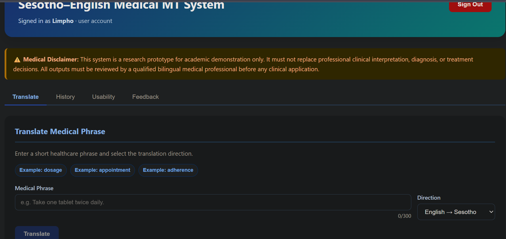
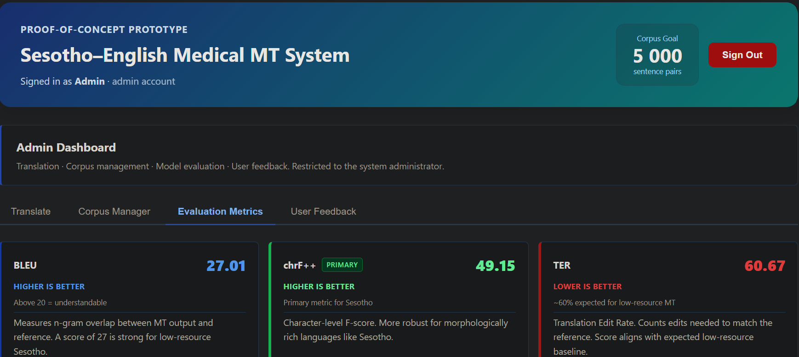

# Sesotho Medical MT

Medical text translation between English and Sesotho, built for healthcare workers and patients in Lesotho.

>  **Medical Disclaimer:** This is a research prototype. Do not use for clinical diagnosis, treatment decisions, or emergency care. All outputs must be reviewed by qualified bilingual or medical personnel before real-world use.

---

##  Links

| | |
|---|---|
| **Live App** | https://sesotho-medical-mt.vercel.app |
| **Backend API** | https://limpho-sesotho-medical-backend.hf.space |
| **Model on Hugging Face** | https://huggingface.co/Limpho/nllb-finetuned-sesotho |
| **Video Demo** | https://youtu.be/UwYzKs-oDpM |
---

##  App Interfaces

### Translator — User View
Translate medical text between English and Sesotho. Medical disclaimer shown on load. Users can view translation history, submit feedback, and complete usability testing.



---

### Admin Dashboard — Evaluation Metrics
Live BLEU, chrF++, and TER scores computed from the held-out medical test set. Accessible to admin accounts only.



---

##  Designs

### Figma Mockups
[View Figma Mockups](https://figma.com/your-link-here)

### UI Screenshots

| Screen | File |
|---|---|
| Translator — User View | `docs/screenshots/01_translator.png` |
| Evaluation Dashboard — Admin | `docs/screenshots/02_evaluation.png` |

---

##  Environment Setup

### Prerequisites

| Tool | Version |
|---|---|
| Python | 3.9 or higher |
| Node.js | 18 or higher |
| pip | Latest |
| Git | Latest |

---

### 1. Clone the Repository

```bash
git clone https://github.com/L-Semakale/sesotho-medical-mt.git
cd sesotho-medical-mt
```

---

### 2. Backend Setup

```bash
# Create and activate virtual environment
python -m venv venv

# Windows PowerShell
venv\Scripts\activate

# macOS / Linux
source venv/bin/activate

# Install dependencies
pip install -r backend/requirements.txt

# Start the backend
cd backend
python app.py
```

Backend runs at `http://localhost:5000`

Expected startup output:

```
FAISS index built — 5,000 rows
Translation pipeline ready:
  Layer 1 → Exact corpus match
  Layer 2 → Semantic similarity (FAISS + Sentence Transformers)
  Layer 3 → NLLB-200 neural translation
  Safety  → High-risk term detection active
Running on http://127.0.0.1:5000
```

---

### 3. Frontend Setup

```bash
# From project root
cd frontend
npm install
npm start
```

Frontend runs at `http://localhost:3000`

Create a `.env` file inside `frontend/`:

```env
REACT_APP_API_URL=http://localhost:5000
```

---

### Default Admin Account

| Field | Value |
|---|---|
| Username | `admin` |
| Password | `Admin@MT2025` |

> Change this before any shared or public deployment.

---

##  Deployment

The system is fully deployed and live.

| Layer | Platform | URL |
|---|---|---|
| **Frontend** | Vercel | https://sesotho-medical-mt.vercel.app |
| **Backend API** | Hugging Face Spaces (Docker) | https://limpho-sesotho-medical-backend.hf.space |
| **Model** | Hugging Face Model Hub | `Limpho/nllb-finetuned-sesotho` |

### Architecture

```
Browser
  │
  ▼
React — Vercel
  │
  ▼  REACT_APP_API_URL
Flask API — Hugging Face Spaces (Docker, Python 3.9)
  │
  ├── Layer 1: Exact match → medical_corpus.csv
  ├── Layer 2: FAISS semantic search
  └── Layer 3: Fine-tuned NLLB-600M (Hugging Face Hub)
                    │
                    ▼
              Safety Filter
                    │
                    ▼
              Response → User
```

### Deploying Your Own Instance

**Backend — Hugging Face Spaces (Docker)**

```bash
# Ensure your Space README.md contains:
# sdk: docker
# app_port: 7860

git push origin main
# Hugging Face auto-builds from Dockerfile on push
```

**Frontend — Vercel**

```bash
# Set environment variable in Vercel dashboard:
# REACT_APP_API_URL = https://your-space.hf.space

npm run build
# Connect GitHub repo to Vercel — auto-deploys on push
```

**Environment Variables**

| Variable | Where | Value |
|---|---|---|
| `REACT_APP_API_URL` | Vercel | Your Hugging Face Space URL |
| `HF_TOKEN` | HF Space Secrets | Hugging Face access token |

> The free-tier Hugging Face Space sleeps after 48 hours of inactivity. The first request after sleep takes ~60 seconds to wake up.

---

##  Code Files

### Project Structure

```
sesotho-medical-mt/
├── backend/
│   ├── app.py                      # Flask API — all routes and endpoints
│   ├── database.py                 # Database schema, queries, init
│   ├── nllb_translator.py          # 3-layer translation pipeline
│   ├── safety.py                   # High-risk medical term detection
│   ├── usability.py                # SUS score collection and storage
│   ├── requirements.txt            # Python dependencies
│   ├── Dockerfile                  # Docker config for Hugging Face Spaces
│   └── data/
│       ├── medical_corpus.csv      # 5,000 English–Sesotho verified pairs
│       └── system.db               # SQLite — users, history, feedback, SUS
├── frontend/
│   └── src/                        # React application source
├── notebook/
│   └── 01_data_eval_model.ipynb    # Data preparation and model evaluation
├── docs/
│   └── screenshots/                # UI screenshots
├── research_archive/               # Training data, evaluation scripts, results
└── README.md
```

---

### `app.py` — API Routes

| Route | Method | Description |
|---|---|---|
| `/health` | GET | Health check |
| `/api/translate` | POST | Translate text |
| `/api/history` | GET | User translation history |
| `/api/feedback` | POST | Submit translation feedback |
| `/api/sus` | POST | Submit SUS usability score |
| `/api/admin/metrics` | GET | BLEU, chrF++, TER (admin only) |
| `/api/admin/users` | GET | User list (admin only) |

---

### `nllb_translator.py` — Translation Pipeline

```
Input text
    │
    ├── Layer 1: Exact match → medical_corpus.csv
    │               └── hit → return verified translation
    │
    ├── Layer 2: FAISS semantic search (threshold: 0.88)
    │               └── hit → return verified translation
    │
    └── Layer 3: Fine-tuned NLLB-600M
                    └── generate → safety filter → return translation
```

---

### `safety.py`
Scans all Layer 3 outputs for high-risk medical terms. Flags any output that requires human review before use.

---

### `database.py` — Schema

| Table | Contents |
|---|---|
| `users` | Accounts, roles, hashed passwords |
| `translations` | Input, output, direction, model, timestamp |
| `feedback` | Per-translation user feedback |
| `usability_feedback` | SUS scores and responses |

---

### `requirements.txt`

```
flask
flask-cors
transformers
torch
sentencepiece
faiss-cpu
sentence-transformers
pandas
sacrebleu
```

---

##  Translation API

**Endpoint:** `POST https://limpho-sesotho-medical-backend.hf.space/api/translate`

**Request:**
```json
{
  "text": "Take this medication twice a day",
  "direction": "en-st",
  "username": "admin"
}
```

**Response:**
```json
{
  "input_text": "Take this medication twice a day",
  "translated_text": "noa meriana ena habeli ka letsatsi",
  "direction_label": "English → Sesotho",
  "model": "nllb_model",
  "safety": {
    "is_high_risk": false,
    "detected_terms": [],
    "requires_review": false,
    "warning": null
  }
}
```

| Field | Values |
|---|---|
| `direction` | `en-st` English → Sesotho · `st-en` Sesotho → English |
| `model` | `verified_corpus` · `nllb_model` |
| `safety.is_high_risk` | `true` if high-risk medical terms detected |

---

##  Limitations

- CPU-only inference — Layer 3 translations take 3–8 seconds per sentence
- Corpus covers 5,000 pairs across 7 medical domains — unseen phrases use neural generation
- Not clinically validated — all outputs require human review before real-world use
- 6 SUS participants — sufficient for proof-of-concept, not for generalised usability claims
- Free-tier backend may cold-start after inactivity

##  License

Research prototype developed for academic purposes.  
Not licensed for clinical or commercial deployment.
```
